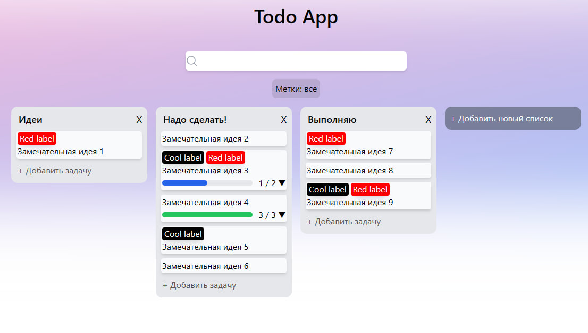

## About
Simple todo app written in Vue.js



## Features
- Drag and drop todos
- Todo labels
- Todo subtasks
- Multiple todo lists
- Todos editing
- Search by keyword and labels
## How to run
```sh
npm install
npm start
```
Then go to `http://localhost:3000` in your browser.
